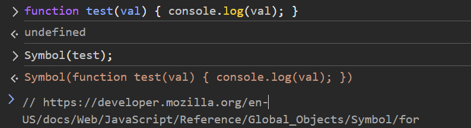
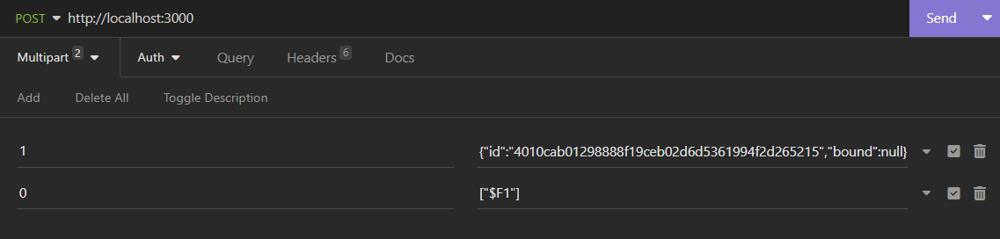
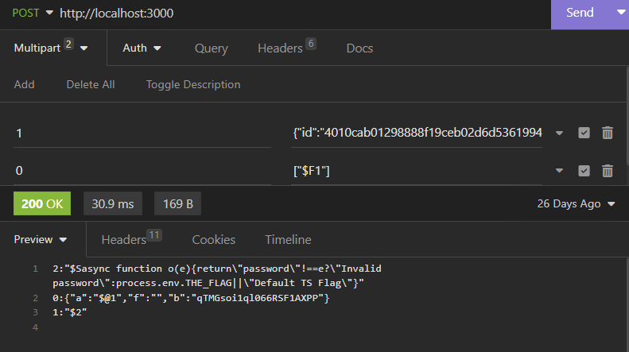

# Write Up

(be I know the answer, so maybe it's not a good one)

The first and important step for the challenge, is to understand that the server is Next.js
Next.js grow up fast on dev world. You can use server/client with the same code base.

Some direct and indirect hint help us to identify where to look at:

- The "stock" or "action" randomply displayed are all "server" action.
- The "getTitle" found on the source code when call, make a POST with the header "next-action"
- Response header contains "x-powered-by: Next.js"

During this reco phase, we can also found some stuff related to "flag"

```
r.createServerReference)("40c37ba0530b51a643844a69cafbee61d8361319d3", r.callServer, void 0, r.findSourceMapURL, "getFlag");
```

This is the same looking code as 
```
r.createServerReference)("001c2ebde0def9957d3202370f1db5bfe8065f96cd", r.callServer, void 0, r.findSourceMapURL, "getTitle")
r.createServerReference)("408c7cb11608730c6a326e5e255dee5393cc1cd4dc", r.callServer, void 0, r.findSourceMapURL, "getSymbolFor");
```

Also, we can see that getFlag seems to be called when

```
await o("what?") === Symbol.for(await f("yeah, but how?"))
```

With some investigation we can call getFlag!
We just swap the header `next-action` on a call to getTitle for getFlag.

```
0:{"a":"$@1","f":"","b":"WUipqKLcHrNeAUg6q9Vns"}
1:"Invalid password"
```

Ok, stuck...
Why we have a getSymbolFor that seem useless (to compare local and server symbol?)
What are those "server action", and how that work ? RTFM


- https://nextjs.org/docs/app/api-reference/directives/use-server
- https://react.dev/reference/rsc/server-functions
- https://github.com/facebook/react/blob/ac799e569d5899c67d72a3e9af5c18b0672eb998/packages/react-server/src/ReactFlightReplyServer.js#L935

(the last link is maybe complicated, but maybe you need it)

## Server side Symbol.for

Let play with getSymbolFor, and pass "coucou"

```
2:"$Scoucou"
0:{"a":"$@1","f":"","b":"qTMGsoi1ql066RSF1AXPP"}
1:"$2"
```

That is really ugly, but with real quick analys of github source code:

- 0,1 and 2 are "chunks"
- $@1 is a reference to chunk 1
- $S seems to be a symbol

## Local side Symbol.for

(let jump direclty to interesting part of the amazing world of javascript)


So, the symbol of a function, is the "source" code of the function !

Ok, it's nice to know but the function is on server side. How to I pass function ?

## Server reference (the tryhard way)

```
      case 'F': {
        // Server Reference
        const ref = value.slice(2);
        // TODO: Just encode this in the reference inline instead of as a model.
        const metaData: {
          id: ServerReferenceId,
          bound: null | Thenable<Array<any>>,
        } = getOutlinedModel(response, ref, obj, key, createModel);
        return loadServerReference(
          response,
          metaData.id,
          metaData.bound,
          initializingChunk,
          obj,
          key,
        );
      }
```

So, react server as a way to pass server reference, from front to server with the "$F"

May take a long time to reverse/undestand so here is the answer



When we see the answer, it's "easy" to understand, but almost impossible from the review of the code (at least for me...)

## Server reference (the easy way)

So, the easiest is to make a small next.js app, and call a server function from the front to see what the format is :D


## Get the source!



(ps: this is my local password for the function, not the used during the challenge)

## Get the flag

Now, with the password of the method getFlag, we can get the flag.

## Outro

Really, what the hell is that server action, and all the strange mapping/converting of object ?

Server action are POSTed to any URL where the action can be used, and often are not handled by middleware (for auth)
If a server action is used on a layout, you can POST on any url...
